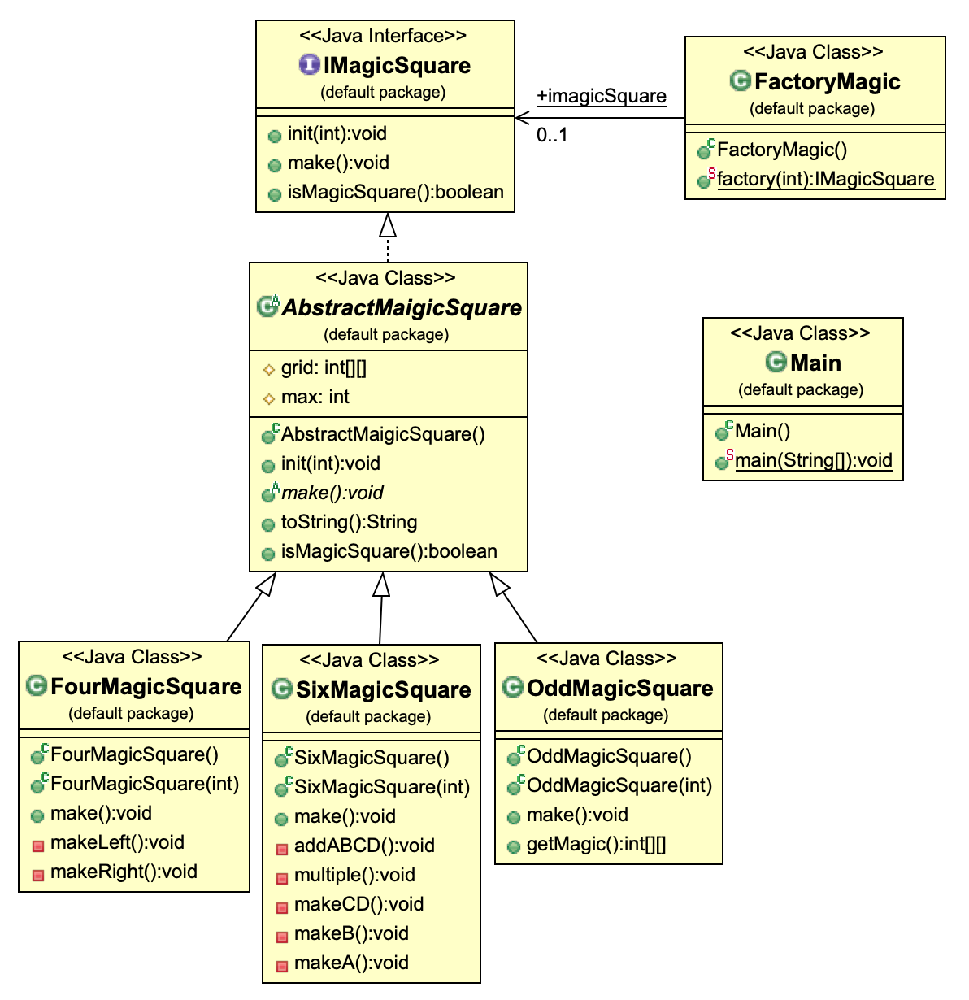

# magicSquare

마방진을 팩토리 디자인 패턴을 통해 구현

```sh
// 자바 컴파일
javac -Xlint -d ./classes ./magic/**/*.java

// 컴파일된 class 실행
java -cp ./classes magic.Main

// 컴파일된 class 삭제
rm -rf ./classes
```

## Class Diagram


